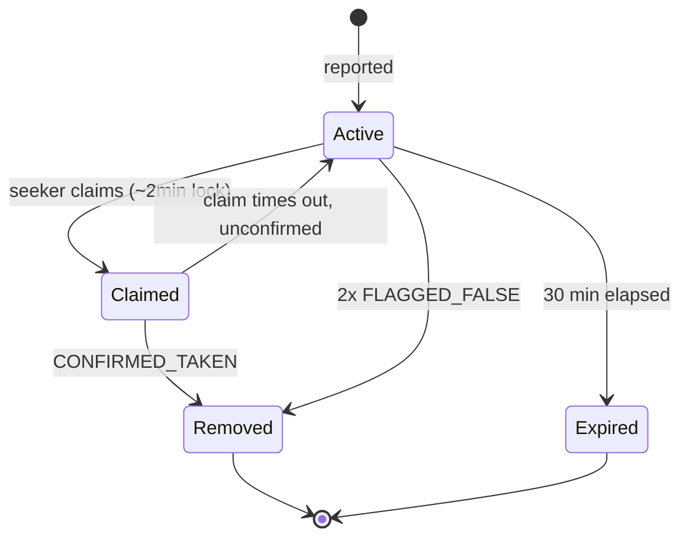

# ADR-0003: Core domain model — User, Spot, SpotFeedback

## Status
Accepted

## Context
`docs/PRODUCT_SPEC.md` defines the functional requirements (spot
lifecycle, claim mechanism, anti-abuse, gamification) but not the
underlying entities. Before an API or database can be designed
(ROADMAP Phase 1), the domain needs a concrete, storage-agnostic
model that every functional requirement maps onto.

## Decision
Three entities cover the full spec:

**User**
- `id`, `auth_provider` + `external_id`, `display_name`
- `points` (all-time, cumulative — never resets)
- `weekly_points` (drives the leaderboard; resets weekly)
- `consecutive_bad_reports` (increments on a `FLAGGED_FALSE`
  against their own spot; resets on a `CONFIRMED_TAKEN`)
- `reporting_blocked_until` (nullable — set once
  `consecutive_bad_reports` hits the abuse threshold)

**Spot**
- `id`, `reporter_id` (→ User), `location` (lat/lng)
- `spot_type` (street | lot | disabled | ev_charging), `payment` (free | paid)
- `photo_url` (nullable, stored only after the AI blur step)
- `status` (active | claimed | removed | expired)
- `reported_at`, `claimed_by` (nullable → User), `claimed_at` (nullable)
- `removed_reason` (nullable: taken_confirmed | flagged_false | expired), `removed_at`

Hot / Warm / Cold are **not** stored states — they're a presentation
label computed from `now - reported_at` while `status = active`.

**SpotFeedback** (single entity for both feedback types, distinguished by `type`)
- `id`, `spot_id` (→ Spot), `user_id` (→ User)
- `type` (confirmed_taken | flagged_false), `created_at`

### State machine

## Alternatives Considered
- **Separate `SpotConfirmation` / `SpotFlag` tables** instead of one
  `SpotFeedback` with a `type` column — rejected: same shape, same
  query patterns, no benefit to splitting them.
- **Points as a running counter only** (no ledger of individual
  earning events) — chosen for MVP simplicity over an event-sourced
  points ledger; revisit if we ever need to audit/undo a specific
  point award (e.g. a report gets flagged as false *after* points
  were already granted).

## Consequences
- Every functional requirement in `PRODUCT_SPEC.md` maps directly to
  a field or transition here — no product concept is unaccounted for.
- Hot/Warm/Cold being computed (not stored) means no background job
  is needed just to age spots; only `expired` needs a sweep/TTL.
- The counter-based points model means correcting a bad point award
  later requires a manual adjustment, not an automatic ledger replay.

## Related
- Refs: `docs/PRODUCT_SPEC.md`, ROADMAP Phase 1 ("Define core domain")
